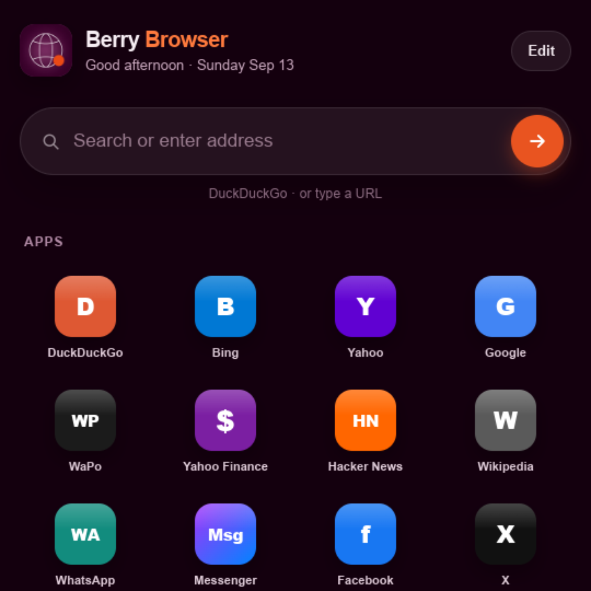
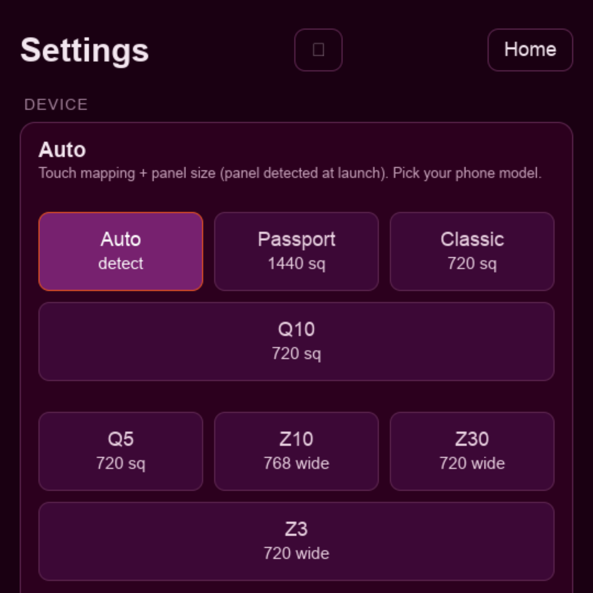

# Berry Browser V3

**Version 3.0.2, build 106** · **Chromium 120.0.6099.234** · `com.sw7ft.BerryShellV3`

Berry Browser is a **modern web browser for BlackBerry 10**. It runs a genuine, current-generation **Chromium** engine on QNX — not a reskin of the stock 2013 WebKit browser — which means today's sites get today's rendering, JavaScript, and TLS. The engine is ported to BB10's native **Screen** graphics stack through a purpose-built **Ozone** backend, with **EGL compositing** on the device's Adreno GPU.

It is compiled specifically for this hardware: **ThinLTO** plus **profile-guided optimization**, where the optimization profile was collected from real browsing sessions on a **Passport**. The result is measurably faster on the paths that matter on a 32-bit ARM phone — the event loop, garbage collection, CSS, and the compositor.

**Nine device panels** are auto-detected and supported: Passport, Classic, Q20, Q10, Q5, Z10, Z30, Z3, and Leap. Render buffer size and touch coordinate mapping scale to each.

The settings menu is unusually deep for a mobile browser — **13 sections** covering Device, Display, Frame rate, Content & privacy, Network, YouTube, Identity, Performance, JS memory, Developer, Home screen shortcuts, Share & system, and Start page. Inside those are **24 on/off toggles**, three tap-to-select preset rows, and three free-text fields.

That depth is deliberate. Running a modern engine on decade-old hardware means the right trade-off differs per device and per site, so the trade-offs are exposed instead of hidden: resolution tier (420² through native 1440), frame-rate cap (60 down to 15fps, with combined performance presets), V8 heap ceiling (256MB to 1GB), GPU versus software rendering, low-end memory mode, service workers, ad and tracker blocking, HTTP/3 and HTTP/2 control, per-site desktop or mobile identity, and a developer tier with stall attribution, frame timing, and crash-log diagnostics.

**Berry Browser is beta software under active development.** Some heavyweight sites still struggle.

---

**Live promo site:** [sw7ft.github.io/berry-browser](https://sw7ft.github.io/berry-browser/)

**Demo:** [YouTube — Passport walkthrough (~8:55)](https://www.youtube.com/watch?v=5H_1-b8XfA0&t=535s)

## Download (build 106)

| | |
|---|---|
| **BAR** | [BerryBrowserV3-3.0.2-build106.bar](https://github.com/sw7ft/berry-browser/releases/download/v3.0.2-build106/BerryBrowserV3-3.0.2-build106.bar) (~55 MB) |
| **Release** | [v3.0.2-build106 notes](https://github.com/sw7ft/berry-browser/releases/tag/v3.0.2-build106) |
| **Previous** | [build 105](https://github.com/sw7ft/berry-browser/releases/tag/v3.0.2-build105) |

Enable Development Mode → sideload the `.bar` (Sachesi, DDPB, or on-device installer) → launch **Berry Browser**.

## Support

If Berry Browser helps you, please consider supporting:

- **[SW7FT on Patreon](https://www.patreon.com/c/Sw7ft)** — Berry Browser, Chromium port, ongoing BB10 work
- **[bb10root on Patreon](https://www.patreon.com/bb10root)** — legacy BB10 work; a BB10 warrior who truly deserves the credit

Thank you to everyone in this community. **Long live BlackBerry.**

## Screenshots

## Engine source

This repo is the **promo + release hub**, not the Chromium tree. Port, patches, and docs: **[sw7ft/chromium-for-bb10](https://github.com/sw7ft/chromium-for-bb10)** (`berry-v3`).

Related: [BerryCore](https://github.com/sw7ft/BerryCore) · [berrycore.sw7ft.com](https://berrycore.sw7ft.com/)

Not affiliated with BlackBerry Limited.
